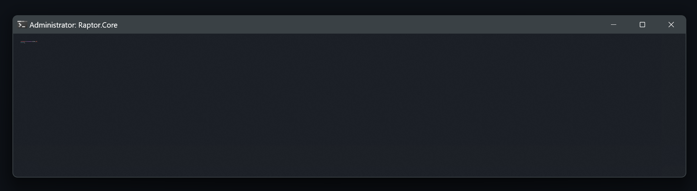

# BinaryOxide~

A developer-driven space focused on building lightweight tools, experimenting with system internals, and exploring how software interacts with hardware.  
Projects here emphasize clarity, performance, and a deep curiosity for operating systems.

---

### 🧭 Current Focus

- 🔭 Developing **BinaryFetch** — a modern Windows system information tool inspired by Neofetch  
- 🌱 Expanding proficiency in C++, Python, Git, and Linux  
- 🧩 Experimenting with OS behavior, optimization, and scripting  
- 🎮 Exploring Unreal Engine workflows and low-level engine mechanics  

---

### 🛠 Tech Stack

| Domain | Tools / Languages |
|-------|-------------------|
| **Languages** | C++, Python, Bash |
| **Tools** | VS Code, Git, GitHub |
| **Operating Systems** | Windows 11, Arch Linux 🐧, Ubuntu |
| **Engines** | Unreal Engine |

---

### 🎯 Core Interests

- System programming  
- Hardware & OS-level information retrieval  
- Cross-platform tool building  
- Linux tinkering & desktop environment customization  
- Clean code design and performance-focused development  

---

### 🌐 Connect

- 📸 Instagram: [@studiobinaryoxide](https://www.instagram.com/studiobinaryoxide/)  

> This space is maintained by a creator who enjoys crafting meaningful tools, learning deeply, and pushing boundaries—quietly, consistently, and with purpose.
