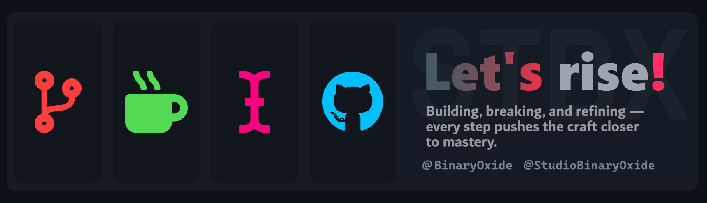
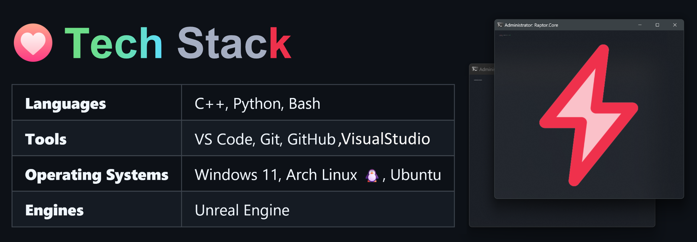
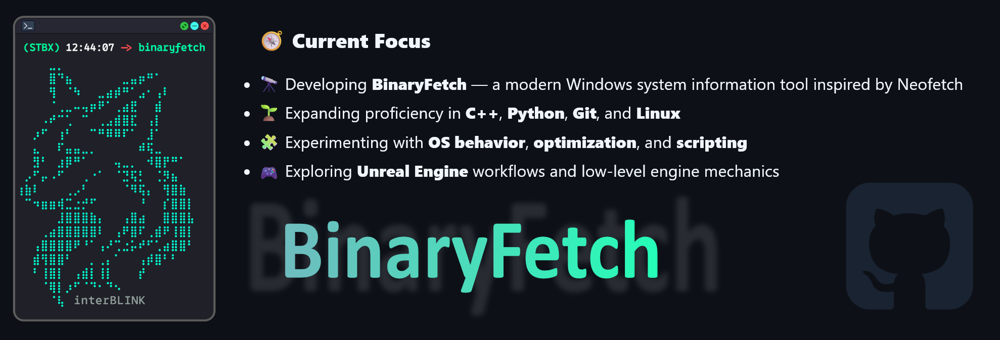

# BinaryOxide~

A developer-driven space focused on building lightweight tools, experimenting with system internals, and exploring how software interacts with hardware.  
Projects here emphasize clarity, performance, and a deep curiosity for operating systems.

---

### 🎯 Core Interests

- System programming  
- Hardware & OS-level information retrieval  
- Cross-platform tool building  
- Linux tinkering & desktop environment customization  
- Clean code design and performance-focused development  

---

### 🌐 Connect

- 📸 Instagram: [@studiobinaryoxide](https://www.instagram.com/studiobinaryoxide/)
- Email: 2009marufhasanpersonal@gmail.com 

> This space is maintained by a creator who enjoys crafting meaningful tools, learning deeply, and pushing boundaries—quietly, consistently, and with purpose.

